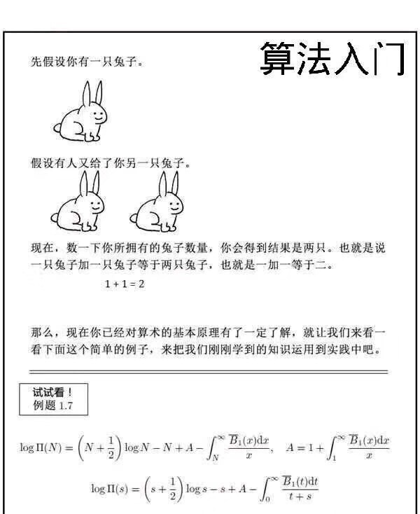

外面疫情严重,只能赋闲在家,闲着也是闲着,来学用fft画画吧


<!--more-->

~~顺便预习一下马上要学的QT~~

\### **fft**

既然要用fft画画当然要会fft的呀,什么你还不会fft?


如果你不会请去自己学  ~~其实有板子在会不会有什么区别呢~~  

这里丢个一直在用的fft板子  

复数类板子  
```cpp

class Complex{

private:

    qreal a,b;

public:

    Complex(qreal a=0,qreal b=0):a(a),b(b){}

    Complex operator * (qreal x)const;

    Complex operator * (const Complex &y)const;

    Complex operator + (const Complex &y)const;

    Complex operator - (const Complex &y)const;

    qreal length()const{

        return sqrt(a*a+b*b);

    }

    qreal real()const{return a;}

    qreal img()const{return b;}

};

Complex operator * (qreal x,Complex y);

Complex Complex::operator*(qreal x) const{

    return Complex(this->a*x,this->b*x);

}

Complex Complex::operator*(const Complex &y) const{

    Complex ret(this->a*y.a-this->b*y.b,this->a*y.b+this->b*y.a);

    return ret;

}

Complex Complex::operator+(const Complex &y) const{

    return Complex(this->a+y.a,this->b+y.b);

}

Complex Complex::operator-(const Complex &y) const{

    return Complex(this->a-y.a,this->b-y.b);

}

Complex operator * (qreal x,Complex y){

    return y*x;

}

```

fft板子  

```cpp

void fft(QVector<Complex>&data,int n){

    QVector<int> rev(n);

    int R = 0;

    while((1<<(R+1))<=n)R++;

    for(int i=0;i<n;i++)rev[i]=(rev[i>>1]>>1)|((i&1)<<(R-1));

    for(int i=0;i<n;i++){

        if(i<rev[i])

            std::swap(data[i],data[rev[i]]);

    }

    qreal pi = acos(-1);

    for(int i=1;i<n;i<<=1){

        Complex w(cos(pi/i),sin(pi/i));

        for(int j=0;j<n;j+=(i<<1)){

            Complex wn(1,0);

            for(int k=0;k<i;k++){

                Complex x=data[j+k],y=wn*data[j+i+k];

                data[j+k]=x+y;

                data[i+j+k]=x-y;

                wn=wn*w;

            }

        }

    }

}

```

这里顺便说下绘图的原理,像是在做函数曲线一样,要描点连线  

也就是要求一开始要给我一个点列$A[i]=(x_i,y_i)$  

为了让它fft,需要把这个点列转化到复平面上$A[i]=x_i+y_i*i$  

顺便记点数为$n$

然后就可以fft了呢  

假设生成的数列为$B[i]$   

那我们明显有

$$A[j]=\frac{1}{n}*\sum_{k=0}^{k<n}B[k]*e^{\frac{2\pi ji}{n}*k}$$

因为每一项都是复数,所以我们可以把它对应到复平面上,这样$A[j]$就变成了一系列向量的和,有了明显的几何意义  


### **QT**

##### **安装**

请去清华镜像站下载安装包

##### **用QT绘画**

好像有两种办法来着  

1.QPainter  

2.QGraphics  

第一种跟java swing那套理论差不多要自己重写绘图事件,鉴于之前就被swing恶心到了,而且这种方式一点都不OOP于是选了第二种  

第二种就是

一些基本的图形由QGraphicsItem继承得到  

要把这些图形丢到QGraphicsScene里,让它来做排版  

然后把QGraphicsScene丢给QGraphicsView让它显示出来就好了呢!  

具体的代码在下一节  

##### **signal and slot**

这个是Qt里新的逻辑呢

简单的用法是

```cpp

QObject::connect(发出信号的对象地址,SIGNAL(信号函数),接受信号的对象地址,SLOT(槽函数));

```

一旦这样做了之后呢

发出信号的函数一旦发出了信号,接受信号的对象就会立即执行槽函数  

跟javafx里的property机制很像呢  

举个具体的例子吧  

```cpp

    QApplication a(argc, argv);

    QGraphicsScene *scene = new QGraphicsScene(0,0,1024,768);

    QGraphicsView *view = new GraphicsView(scene);

    QPushButton *button = new QPushButton("exit");

    QObject::connect(button,SIGNAL(clicked()),&a,SLOT(exit()));

    view->addWidget(button);

    view->show();

```

这样如果按钮被点击了,窗口就会被关闭了  

##### **QTimeLine**

毕竟要做出来的是个动画  

当然要学学时间轴啦 ~~其实不会也没事呢~~  

下面是代码节选  

```cpp

QTimeLine *time = new QTimeLine(40000);

time->setFrameRange(0,1024);

QObject::connect(time,SIGNAL(frameChanged(int)),scene,SLOT(next()));

time->start();

```

第一个构造函数里面的参数是时间轴持续的时间,单位毫秒  

setFrameRange(int,int)  

第一个参数表示每帧耗时多少毫秒 如果填0的话默认每帧40毫秒  

第二个参数表示一共有多少帧  

注意如果进行着时间超出了一开始构造函数的时间,就停了,当然如果时间到了还没进行完,也会停  

那个next()是我定义的函数,作用是描下一个点  


到现在为止就已经可以完成整个动画了呢  




### **Qt打包**

当你做好了程序想要给小伙伴展示的时候怎么可能简简单单地丢给他们代码呢?  

qt打包的方法网上到处都是,我们来说说我犯过的坑吧  

\##### **提示无法定位到Q5Gui.dll类**

可能你的打包程序出了锅,你可以尝试ProcessExplorer然后把程序调用的dll自己挑过去


##### **0x000000007b 大约长这样子~**

当你好不容易找全了dll,却发现了这么个错这是为啥呢  


 


经过我漫长的调试,发现原因是我在qtcreator里编译是用的qt自带的gcc  

但是打包时我用的是dev里的cpp  

因为我原来在用gcc的时候把dev的gcc在环境变量里优先度提得太高了

于是打包的时候gcc自动用了dev的,导致版本不一致  

于是在环境变量设置里把qt的gcc优先度调到最高就好了呢  


### **项目代码**

我放到github上了  

[链接](https://github.com/kvrmnks/FFt-drawing)